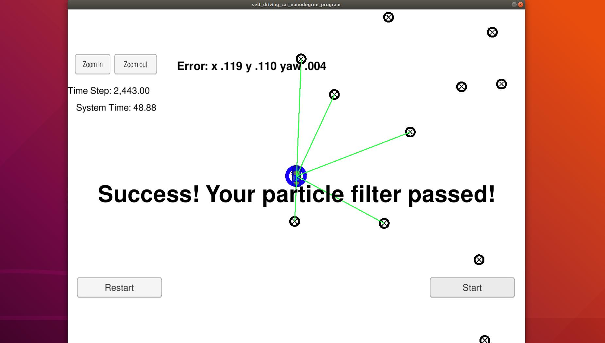

# Locolization with Particle Filters

## Introduction
This project locolizes a robot using a map, noisy GPS estimate on the initial lociatin, and noisy sensor/control data. A 2 dimensional particle filter in C++ implemented.

## Running the Code
This project uses a simulator that can be found [here](https://github.com/udacity/self-driving-car-sim/releases)

This repository includes two files that can be used to set up and install uWebSocketIO for either Linux or Mac systems. For windows you can use either Docker, VMware, or even Windows 10 Bash on Ubuntu to install uWebSocketIO.

Once the install for uWebSocketIO is complete, the main program can be built and ran by doing the following from the project top directory.

1. mkdir build
2. cd build
3. cmake ..
4. make
5. ./particle_filter

Alternatively some scripts have been included to streamline this process, these can be leveraged by executing the following in the top directory of the project:

1. ./clean.sh
2. ./build.sh
3. ./run.sh

# Implementing the Particle Filter

## Inputs to the Particle Filter
You can find the inputs to the particle filter in the `data` directory.

#### The Map*
`map_data.txt` includes the position of landmarks (in meters) on an arbitrary Cartesian coordinate system. Each row has three columns
1. x position
2. y position
3. landmark id

### All other data the simulator provides, such as observations and controls.

> * Map data provided by 3D Mapping Solutions GmbH.

##Accuracy:

| Dimension     | Error	 |
|---------------|--------|
|x              | 0.119  |
|y              | 0.110  |
|yaw            | 0.004  |

##Performance:

| Stats         | Performance    |
|---------------|----------------|
|Time to finish | 48.88 seconds  |
|Time steps     | 2,443.00       |

You can see a video of how it works when it is ran in the simulator!!!!!!!!!!!!!!!!!!!!!!!:

